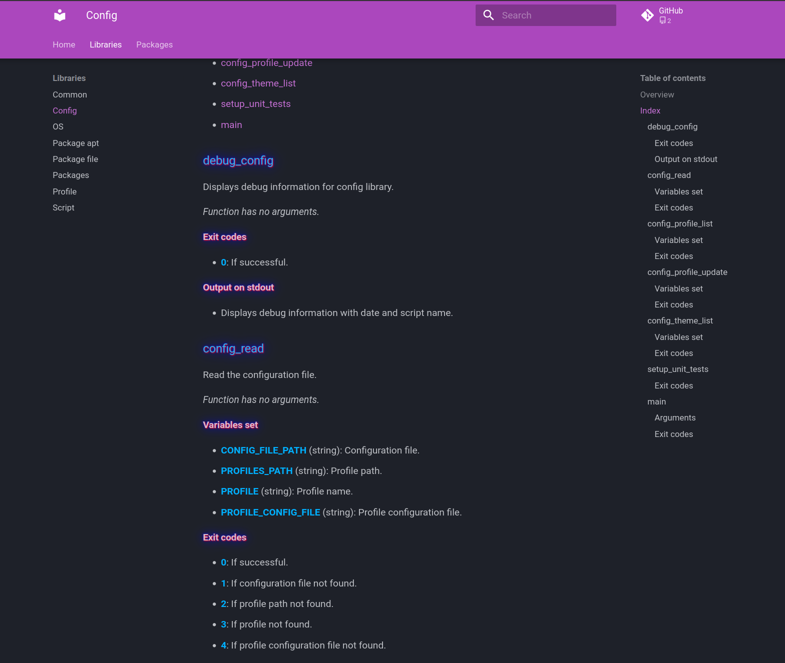

# PimpMyTerm

<p align="left">
  <a href="https://github.com/christopherlouet/pimpmyterm/actions?query=workflow%3Atests"></a>
  
</p>

A toolbox to help you customize your terminal and manage the installation of your favorite packages.

<details>
<summary>Table of Contents</summary>

- [pimpmyterm.sh](#pimpmytermsh)
    - [About](#-about)
    - [Requirements](#-requirements)
    - [Preview](#-preview)
    - [Usage](#-usage)
    - [Configuration](#-configuration)
    - [Features](#-features)
- [utils.sh](#utilssh)
    - [About](#-about)
    - [Preview](#-preview)
    - [Usage](#-usage)
    - [Features](#-features)
- [Packages](#packages)
    - [About](#-about)
    - [Packages in the editor category](#-packages-in-the-editor-category)
    - [Packages in the multiplexer category](#-packages-in-the-multiplexer-category)
    - [Packages in the shell category](#-packages-in-the-shell-category)
    - [Packages in the tools category](#-packages-in-the-tools-category)
    - [Packages in the ui category](#-packages-in-the-ui-category)
    - [Packages in the custom category](#-packages-in-the-custom-category)
    - [Miscellaneous](#-miscellaneous)
- [Miscellaneous](#miscellaneous)
    - [Installation with wsl2](#-installation-with-wsl2)
- [License](#-license)

</details>

## pimpmyterm.sh

### 💡 About

**pimpmyterm.sh** is a utility to help you customize your terminal and manage the installation 
of your favorite packages.

### 🚧 Requirements

* Ubuntu >=20.04

### 🎇 Preview

<p align="center" width="100%">
    
</p>

### 🔍 Usage

```bash
Usage:
  ./pimpmyterm.sh [options] <packages>

Options:
  -u, --update              Updating the package index files
  -i, --install             Installing packages
  -I, --preinstall          Installing prerequisites
  -r, --remove              Remove packages
  -y, --yes                 No confirmation for installation
  -s, --silent              Do not display installation details
  -l, --list                List packages
  -a, --all                 List packages with details
  -c, --category <pattern>  Filter by Category
  -d, --debug               Show debugging information
  -h, --help                Print help
  --no-banner               Do not display the banner
```

### 🔧 Configuration

The script first reads the **config.ini** configuration file to find out the current profile.

The profile configuration file, located in the **profiles** folder, is then read to retrieve **packages information**,
as well as the **date of the last update**, the **theme** and the **banner** to be displayed.

After retrieving package information from the **OS package manager** and **script files**,
detailed package information is written to the **.cache** folder.

To add a **new package** to the project, you'll need to add this information to the .ini file:

* **Category** and **name** of package to display
* Package source: **dist** if retrieved from the package manager, or **file** if retrieved from the package folder
* Package name: **Name** of the package to be searched for in the operating system's package manager or in the script name

Only the category and package name are mandatory.

Example for the htop package retrieved by the operating system's package manager:

```dosini
[tools "htop"]
```

Example for the gnome-theme script, located in the packages/ui folder

```dosini
[ui "Gnome theme"]
source=file
name=gnome-theme
```

You can also modify the **banner** or **theme** in this profile file.

### 🚀 Features

#### 📇 Menu

To display the menu, run the script **without** options:

```bash
./pimpmyterm.sh
```

The menu allows you to manage packages directly and display useful information about the current configuration, 
such as the packages currently installed or the current profile.

The display automatically adapts to the screen size of the terminal reading it.
The terminal resolution can be changed directly by the user.

You can then carry out the actions described below.

#### 🚿 Updating packages

The first time you run the script, the list of packages will be updated in the cache.
This update retrieves package information by reading the profile configuration file.

Information is retrieved from the **OS package manager**, and from script files in the **packages** folder.
The information is updated in the cache folder, allowing packages to be displayed more quickly in the menu.

Choose the ```u``` option to update packages in the menu.

You can also update the list of packages by running this command:

```bash
./pimpmyterm.sh -u
./pimpmyterm.sh --update
```

#### 📁 Display packages

Choose the ```l``` option to display the list of packages for the current profile.

You can also run this command:

```bash
./pimpmyterm.sh -l
./pimpmyterm.sh --list
```

#### 📂 Display additional information

Choose the ```a``` option to display more information about packages.

You can also run this command:

```bash
./pimpmyterm.sh -la
./pimpmyterm.sh -l -a
./pimpmyterm.sh --list -a
./pimpmyterm.sh --list --all
```

Or use this command to bring up the menu:

```bash
./pimpmyterm.sh -a
./pimpmyterm.sh --all
```

#### 🎓 Installing prerequisites

Choose the ``I``` option to install prerequisites. If the package is already installed, this has **no effect**.

You can also run this command:

```bash
./pimpmyterm.sh -I
./pimpmyterm.sh --preinstall
```

#### 🎁 Installing packages

Choose the ```i``` option to install packages.
The script will display the packages **not yet installed**, before asking the user for confirmation.

If the package requires prerequisites to be installed, the script will install them too.

You can also run this command:

```bash
./pimpmyterm.sh -i
./pimpmyterm.sh --install
```

#### 💣 Removing packages

Choose the ```r``` option to remove packages.
The script will display the profile packages that are **already installed** and request confirmation before 
proceeding with the removal.

You can also run the following command to do this directly:

```bash
./pimpmyterm.sh -r
./pimpmyterm.sh --remove
```

#### 🔎 Search a package by name or category

You can search for packages in the menu.

Press ```/``` to search by package name.

The ```c``` key is used to search by package category.

You can also perform a search with the script by adding the package name as **a parameter**, for example:

```bash
./pimpmyterm.sh htop
./pimpmyterm.sh -l htop
./pimpmyterm.sh -la htop eza
```

#### 👢 Change profile   

You can change the profile in the menu by selecting ```p```.

The script will search for profiles located in the project's **profiles** folder.
You can then select a profile from the menu that appears.

The script will update the profile in config.ini, and fetch package information from the selected profile.

#### 🎊 Change theme

The profile theme can be changed by selecting the ```t```.

The menu that appears allows you to select the theme and display a preview.

Once the theme has been validated, it will be updated in the profile configuration file.

#### 👽 Miscellaneous options

These options are also available in the menu:

* Choose the ```h``` option to display help.
* Choose the ```n``` option to find out which packages are not installed.
* Choose the ```s``` option to activate silence mode, and not display installation details.
* Choose the ```y``` option if you don't want to confirm before installing or removing a package.

You can combine **several keys** to perform one or more actions.

Example to install the **htop** and **eza** packages, without user confirmation, and without displaying installation details:

```bash
./pimpmyterm.sh -syi htop eza
```

Example of updating package information, then displaying package details:

```bash
./pimpmyterm.sh -ua
```

## utils.sh

### 💡 About

This toolbox enables you to perform the following actions:

* Generating the API documentation with the **shdoc** utility
* Generating a site from markdown files with **mkdocs**
* Run unit tests with **pytest**
* Linter the code with the **shellcheck** utility
* Install **poetry** if you need to update python dependencies

We use a Docker container to perform these actions, based on a Docker image built with the Dockerfile

### 🎇 Preview

<p align="center" width="100%">
    
</p>

### 🔍 Usage

```bash
Usage:
  utils.sh [options]

Options:
  -h, --help                Display help
  -d, --doc                 Generate the api doc
  -m, --mkdocs              Start the mkdocs server
  -l, --linter              Code linting
  -t, --test                Launch the unit tests
  -f, --force               Remove docker image before launch the unit tests
  -b, --bash                Execute bash in the container
  -p, --poetry              Install poetry
```

### 🚀 Features

#### 📇 Menu

To display the menu, run the **utils.sh** command without parameters.

#### 🔨 Unit tests

To run the **unit tests**, run the following command:

```bash
./utils.sh --test
```

#### 📄 APi documentation

To generate **API documentation** in Markdown format, run the following command:

```bash
./utils.sh --doc
```

#### 💻 mkdocs

To start the **mkdocs server** and browse the API documentation in a browser, run the following command:

```bash
./utils.sh --mkdocs
```

Preview:

| | |
|:-------------------------:|:-------------------------:|
|  |  |

#### ✨ Linter

To analyze the **syntax** of the bash code, run the following command:

```bash
./utils.sh --linter
```

#### 👽 Miscellaneous

To run **bash** in the docker container:

```bash
./utils.sh --bash
```

To install **poetry**:

```bash
./utils.sh --poetry
```

## Packages

### 💡 About

Packages can be installed from the operating system's package manager or from custom scripts located 
in the **packages** folder.

To include them in the profile configuration file, they must meet these criteria:

* Import the script located in **libs/scripts**
* Must contain **main** and **help** functions

To install a package's prerequisites, this script must contain the **pre_install** function.

Example of a script: ```packages/tools/eza.sh```

To install a package, the script must contain the **install** and **check_install** functions.

Example of a script: ```packages/shell/zsh.sh```

Example of a complete script: ```packages/tools/batcat.sh```

Here are some examples of scripts provided by the project.

### 🧩 Packages in the **editor** category

#### code.sh

Installs VSCode prerequisites.

#### neovim.sh

Installation of neovim prerequisites.

#### oh-my-nvim.sh

The library lets you install the neovim theme from hardhackerlabs.

[**oh-my-nvim**](https://github.com/hardhackerlabs/oh-my-nvim)

### 🧩 Packages in the **multiplexer** category

#### oh-my-tmux.sh

The library lets you install the tmux theme from Gregory Pakosz.

[**oh-my-tmux**](https://github.com/gpakosz/.tmux)

### 🧩 Packages in the **shell** category

#### oh-my-zsh.sh

This library is used to clone and install the oh-my-zsh project.

[**oh-my-zsh**](https://github.com/ohmyzsh/ohmyzsh)

#### zsh.sh

The library lets you install zsh without user interaction.

### 🧩 Packages in the **tools** category

#### batcat.sh

The library lets you install the latest version of Batcat.

[**bat**](https://github.com/sharkdp/bat)

#### eza.sh

The library lets you add the Gierens repository to install Eza.

[**eza**](https://github.com/eza-community/eza)

### 🧩 Packages in the **ui** category

#### gnome-theme.sh

The library lets you install a theme in the gnome terminal.

[**Catppuccin for Gnome Terminal**](https://github.com/catppuccin/gnome-terminal)

#### nerd-fonts.sh

The library lets you download and install a font from the Nerd Fonts project.

[**Meslo Nerd font**](https://github.com/ryanoasis/nerd-fonts/tree/master/patched-fonts/Meslo)

### 🧩 Packages in the **custom** category

#### pimpmyterm.sh

This library can be used to install the following packages:

* Meslo Nerd fonts
* Catppuccin Mocha gnome theme
* zsh and oh-my-zsh plugins and theme
* tmux and themes
* Neovim and themes
* VSCode
* fzf, fd-find, Batcat and Eza

In addition to those listed above, the following packages will be installed:

* [**powerlevel10k**](https://github.com/romkatv/powerlevel10k)
* [**fzf**](https://github.com/junegunn/fzf)
* [**fd-find**](https://github.com/sharkdp/fd)

The following keyboard shortcuts will be activated after installation:

* `<Alt>C`  Display current folder tree structure
* `<Ctrl>T` Previewing file contents with batcat and eza
* `<Ctrl>R` Display zsh history

### Miscellaneous

#### 🔨 Installation with wsl2

1️⃣ **Install Ubuntu-22.04 from Microsoft Store and set user password in terminal.**

Make a backup of the distribution, clone the project and run this command
in Windows PowerShell (in the project folder):

```bash
powershell -noexit -nologo -noprofile -executionpolicy bypass -File .\packages\ui\wsl\backup.ps1
```

I recommend performing a restore immediately, in order to properly boot the Ubuntu instance.

```bash
powershell -noexit -nologo -noprofile -executionpolicy bypass -File .\packages\ui\wsl\restore.ps1
```

2️⃣ **To install the font and theme, run this command in Windows PowerShell (in the project folder):**

```bash
powershell -noexit -nologo -noprofile -executionpolicy bypass -File .\packages\ui\wsl\install_font.ps1
powershell -noexit -nologo -noprofile -executionpolicy bypass -File .\packages\ui\wsl\install_theme.ps1
```

3️⃣ **In Ubuntu-22.04, log in with your username, clone the project and install packages:**

```bash
sudo su <username>
git clone https://github.com/christopherlouet/pimpmyterm
./pimpmyterm/pimpmyterm.sh
```

4️⃣ **If you later want to restore the backup, run this command:**

```bash
powershell -noexit -nologo -noprofile -executionpolicy bypass -File .\packages\ui\wsl\wsl_restore.ps1
```

## 📜  License

Distributed under the GPLv3 License.
