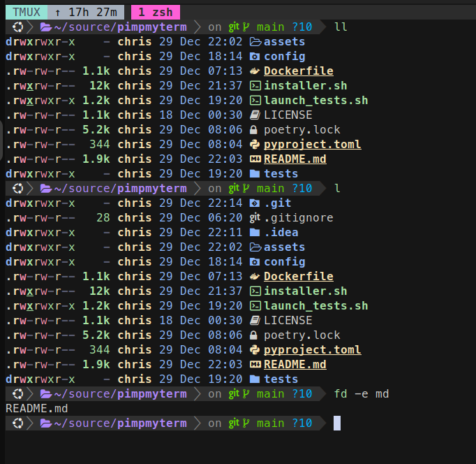
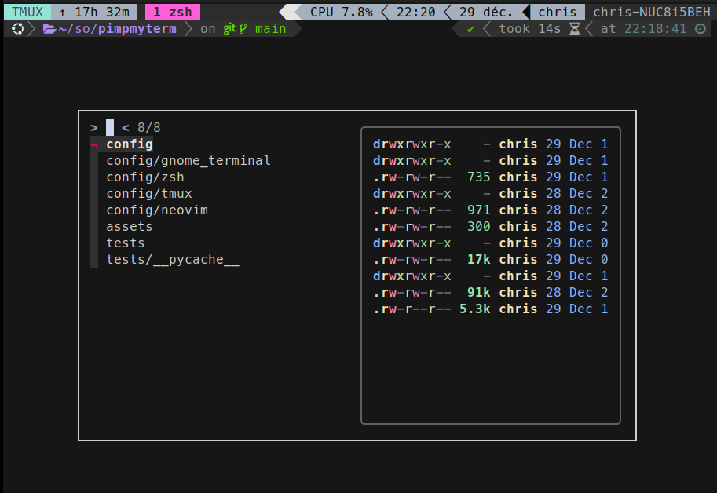
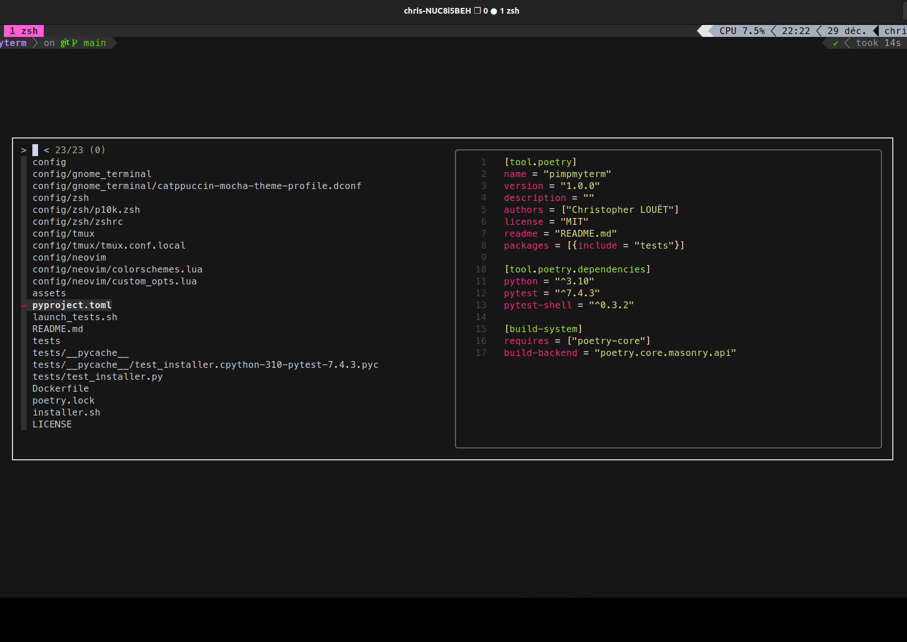
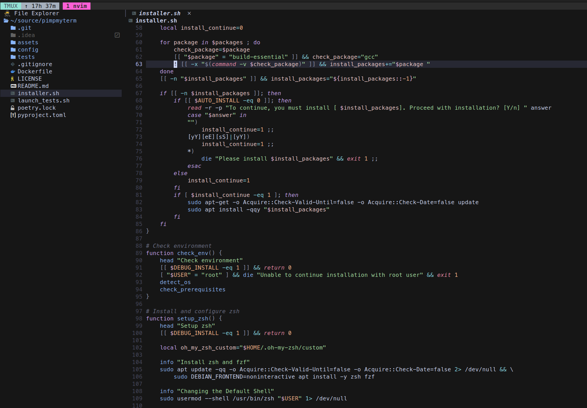

# Pimp My Term
[](https://github.com/christopherlouet/pimpmyterm/blob/main/LICENSE)

A utility script to easily customize the terminal with killer features 😛.

## 🎇 Preview

| | |
|:-------------------------:|:-------------------------:|
|  |  |
|  |  |

## 🚧 Installation

**Requirements**

- Ubuntu 22.04

**Clone Pimp My Term repository**

```bash
git clone https://github.com/christopherlouet/pimpmyterm.git
```

## 💡 Usage

```bash
Usage installer.sh [--all] [--zsh|--neovim|--tmux] [--fonts] [--gnome-terminal] [--auto]
```

1️⃣ **Install zsh, oh-my-zsh, plugins and themes**

```bash
./installer.sh --zsh
```

2️⃣ **Install neovim, plugins and theme**

```bash
./installer.sh --neovim
```

3️⃣ **Install tmux plugins and theme**

```bash
./installer.sh --tmux
```

4️⃣ Install gnome terminal theme

```bash
./installer.sh --gnome-terminal
```

5️⃣ Install Meslo Nerd Fonts

```bash
./installer.sh --fonts
```

## 🚀 Features

### ⌨️ Key bindings

- `<Alt>C`  Print tree structure in the current folder

- `<Ctrl>T` Preview file content using bat and eza

- `<Ctrl>R` Print bash history

### 🧩 Plugins and themes

- [**oh-my-zsh**](https://github.com/ohmyzsh/ohmyzsh)

- [**powerlevel10k**](https://github.com/romkatv/powerlevel10k)

- [**oh-my-tmux**](https://github.com/gpakosz/.tmux)

- [**oh-my-nvim**](https://github.com/hardhackerlabs/oh-my-nvim)

- [**fzf**](https://github.com/junegunn/fzf)

- [**fd**](https://github.com/sharkdp/fd)

- [**bat**](https://github.com/sharkdp/bat)

- [**eza**](https://github.com/eza-community/eza)

- [**Meslo Nerd font**](https://github.com/ryanoasis/nerd-fonts/tree/master/patched-fonts/Meslo)

- [**Catppuccin for Gnome Terminal**](https://github.com/catppuccin/gnome-terminal)

## ⚒ Unit tests

To launch the tests, use the command:

```bash
./tests.sh
```

## 📃 License

Distributed under the MIT License.
